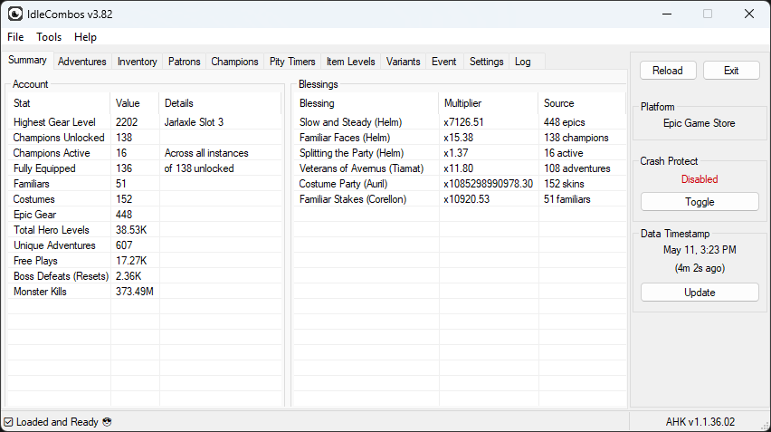
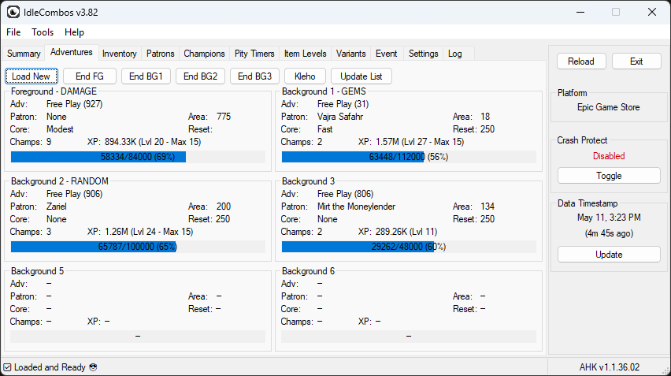
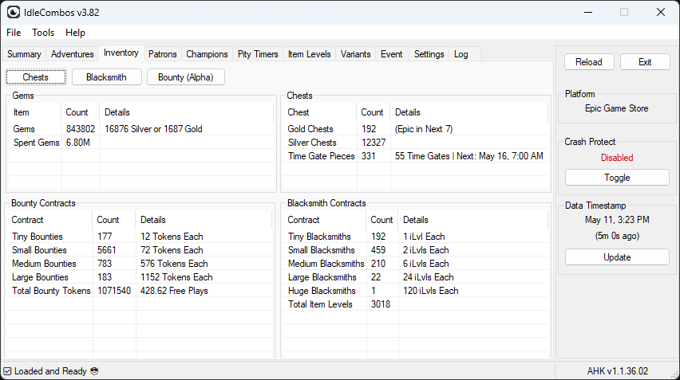
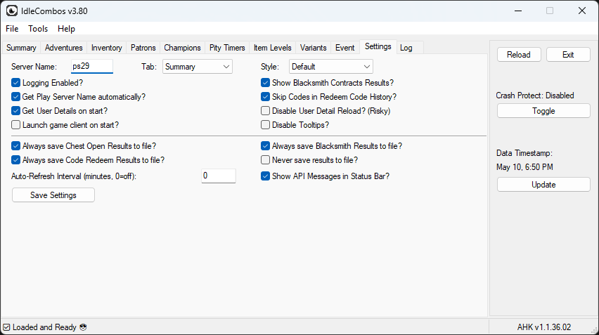

# IDLE COMBOS

Companion App for Idle Champions, written in [AHK](https://www.autohotkey.com/).

**v3.82** is the current supported Version. [View changelog.](https://github.com/djravine/idlecombos/blob/master/CHANGELOG.md)

## Important Notes

* Steam Launcher will not open Idle Champions if Steam is not open and logged in.
* Steam game detection only works if your Steam Library is in the default location.
* If you use a VPN you may have API communication issues. Please whitelist AHK/IdleCombos in your VPN.

## Security Notice

* Your `user_id` and `hash` are stored locally in `idlecombosettings.json`.
* The `hash` is encrypted at rest using Windows DPAPI — only your Windows account can decrypt it.
* Do not share your `hash` with anyone — it grants full API access to your account.
* IdleCombos never sends your credentials anywhere except the official game API server.

## Features

* Simple account statistics display
* Easy buying/opening many chests (Gold/Silver/Event)
* Easy apply bulk blacksmith contracts
* Enter multiple redeem codes at once
* Load active codes directly from the web
* [Briv Stack Calculator](https://github.com/Deatho0ne) integration
* Manual starting/stopping adventures (sometimes can fix stuck accounts)
* Can reload game client on crash (Steam only)

## Requirements

* Steam install *or*
* Epic Games install *or*
* Standalone install *or*
* Able to enter your `user_id` & `hash` if on another platform.

## Includes

* `IdleCombos.ahk` — Main application
* `IdleCombosLib.ahk` — Shared library functions
* `idledict.json` — Champion/chest/campaign ID definitions
* [`json.ahk`](https://github.com/Chunjee/json.ahk) — JSON parsing library
* `Lib/ScrollBox.ahk` — Scrollable text display helper
* `README.md` — This file

## How To Run

* Install [AutoHotKey v1.1](https://www.autohotkey.com/download/ahk-install.exe)
* Checkout this repo or download a [release](https://github.com/djravine/idlecombos/releases)
* If you downloaded a release, unzip into a folder
* Right-click `IdleCombos.ahk` and open with AutoHotKey
* The application will ask you to detect your App ID from your currently installed Idle Champions install folder

## Documentation

* [User Manual](USER_MANUAL.md) — full feature guide, settings reference, and troubleshooting
* [Changelog](CHANGELOG.md) — version history
* [Contributing](CONTRIBUTING.md) — developer setup and guidelines
* [Security](SECURITY.md) — threat model and credential handling
* [Deploy Process](CODE_DEPLOY.md) — release pipeline and packaging
* [Code Flow](CODE_FLOW.md) — startup process diagram and timings
* [Settings Schema](SETTINGS_SCHEMA.md) — settings key history and migration
* [Third Party](THIRD_PARTY.md) — vendored asset inventory with SHA-256 hashes

## Discord

* [Discord Support Server](https://discord.gg/wFtrGqd3ZQ)

## License

[MIT](LICENSE)
